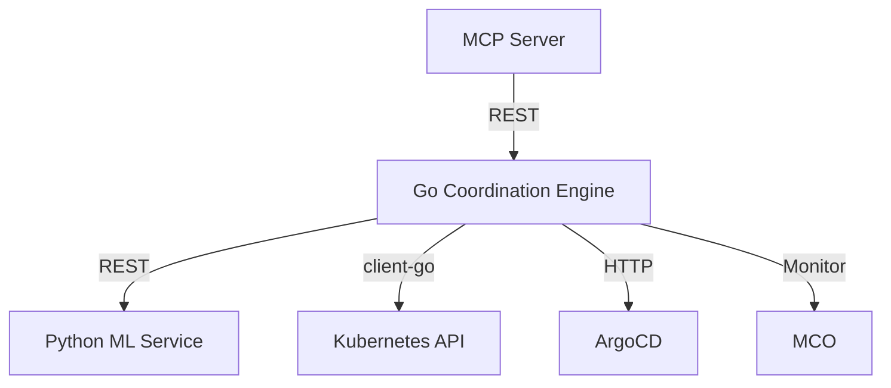

# Go Coordination Engine Architecture

## High-Level Architecture

## Responsibilities

- **Go Engine**: orchestration, remediation, multi-layer coordination
- **Python ML**: anomaly detection, predictions, pattern recognition
- **MCP Server**: natural language interface on top of Go engine

## Repositories

- Platform: `/home/lab-user/openshift-aiops-platform`
- MCP Server: `/home/lab-user/openshift-cluster-health-mcp`
- Go Engine Stub (here): `openshift-coordination-engine/`

See `API-CONTRACT.md` for integration details.

